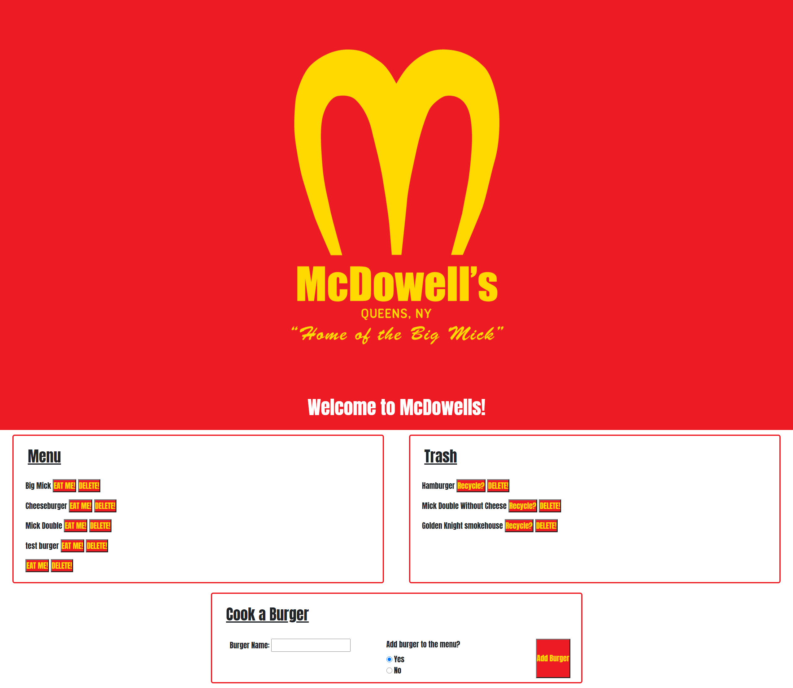

  <!-- PROJECT TITLE -->
   

  <h1 align="center">Burger App</h1>

  [![License][mit]][mit-url]
  
  
  
  <!-- TABLE OF CONTENTS -->
  # Table of Contents
  
  * [About the Project](#about-the-project)
      * [Live Link](#finished-project)
      * [Project Demo](#project-demo)
      * [Built With](#built-with)
  * [Usage](#usage)
  * [License](#license)
  * [Contribution Instructions](#contributions)
  * [Test Instructions](#testing)
  * [Contact / Questions](#contact-or-questions)
  * [Acknowledgements](#acknowledgements)
  
  
  
  <!-- ABOUT THE PROJECT -->
  # About The Project
  
  ## Finished Project
  
  <!-- Add deployed link when available -->
  [Deployed Project](https://salty-garden-94216.herokuapp.com/) 
  
  ## Project Demo
  
  undefined
  

  ## Built With

  * Node.js
  * MySQL
  * Handlebars

  # Usage

  Implementing SQL in an application for learning purposes.

  # License
  
  Begin license text.
        
        Copyright 2020 Brendan Leighton
  
        Permission is hereby granted, free of charge, to any person obtaining a copy of this software and associated documentation files (the "Software"), to deal in the Software without restriction, including without limitation the rights to use, copy, modify, merge, publish, distribute, sublicense, and/or sell copies of the Software, and to permit persons to whom the Software is furnished to do so, subject to the following conditions:

        The above copyright notice and this permission notice shall be included in all copies or substantial portions of the Software.

        THE SOFTWARE IS PROVIDED "AS IS", WITHOUT WARRANTY OF ANY KIND, EXPRESS OR IMPLIED, INCLUDING BUT NOT LIMITED TO THE WARRANTIES OF MERCHANTABILITY, FITNESS FOR A PARTICULAR PURPOSE AND NONINFRINGEMENT. IN NO EVENT SHALL THE AUTHORS OR COPYRIGHT HOLDERS BE LIABLE FOR ANY CLAIM, DAMAGES OR OTHER LIABILITY, WHETHER IN AN ACTION OF CONTRACT, TORT OR OTHERWISE, ARISING FROM, OUT OF OR IN CONNECTION WITH THE SOFTWARE OR THE USE OR OTHER DEALINGS IN THE SOFTWARE.

    

  End license text.

  # Contributions

  Please don't submit pull requests.

  # Testing
  
  N/A

  <!-- CONTACT -->
  # Contact or Questions
  
  * [Email](br3ndan.l8n@gmail.com)
  * [GitHub](https://github.com/BR3NDAN-L8N)
  * [LinkedIn](https://www.linkedin.com/in/brendan-leighton/)
  
  
  
  <!-- ACKNOWLEDGEMENTS -->
  # Acknowledgements
  Heroku
  
  
<!-- MARKDOWN LINKS & IMAGES -->
[mit]: https://img.shields.io/badge/License-The%20MIT%20License-blue
[mit-url]: https://opensource.org/licenses/MIT
